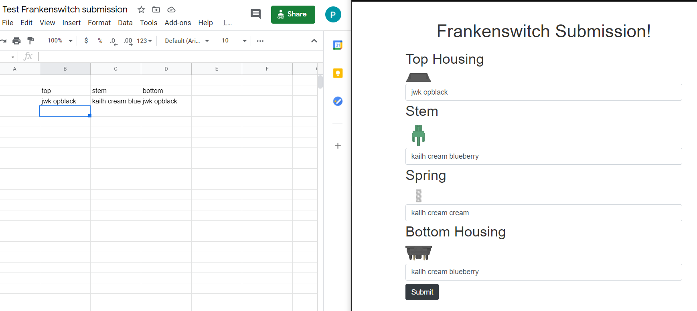

Progress made so far

20/02 5:30am - 10am

- Set up react project
- Created general file structure of the frontend 
  - Components/img/style/views
- Created dropdown menu component for selecting switch part (`Input.js`)
- Added images for each switch part
- FrankenForm.js created which uses the Input component to create each of the input forms for top housing/stem/spring/bottom housing
- Added Alert component that will allow any error messages to be displayed nicely
- Added styling (FrankenForm.css/Input.css) to add margins and make the text easier to read

- Decided on Dark grey text on white backgrounds for the general colour scheme
  - `rgb(52, 52, 52);`
  - default white for background

20/02 10:30am-1pm

- Added feedback messages for switch parts that haven't been selected
  - React-bootstrap typeahead has some UX issues with the search/dropdown menu in that you could type the full option but you can't tell if it's been selected or not
  - Used the Feedback component to alleviate some of this issue
  - Problem: feedback message is unstyled - text is huge

20/02 3:30pm - 6:30pm

- Added github repo https://github.com/Toshi-Tabata/FrankenswitchForm
- Broke down requirements further, still need to break each down
- Updated weekly breakdown

- Created python files for backend
- Attempted to create a database using `psycopg2` and postgres
- Learning about how to format the data (taking ages holy moly)
  - Thinking table for each switch part, with a table for the relations (invalid combinations) 
  - Invalid combinations table has 2 switch parts that make up an invalid combination
  - Switch parts can either be 
    - Top + Bottom
    - Stem + Top
    - Stem + Bottom
    - Bottom + stem is the same - how do i handle that?

21/02 2pm-5pm

- Created tables for 
  - top, bottom, stem, blacklisted combinations, manufacturers
- figured out how to connect between psycopg2's copy of the database and accessing it in `psql` directly
- Figured out a layout for the tables. For top/stem/bottom (edited 8:17pm to add manufacturer and variety columns):

| Name        | Manufacturer |
| ----------- | ------------ |
| "cherry mx" | "cherry"     |

- Blacklist contains at least two of top/bottom/stem, enforced by the constraints added

- Manufacturer for top/stem/bottom must be from the manufacturer table's name column

21/02 7pm - 12:30pm

- Setup credentials for google sheets' API
- Accessed switch database and parsed it for data
- Figured out how to get specific columns from the sheet, and created a module for getting this data
- Used the parsed data from the sheet to populate the tables
- Had to add the "manufacturer" and "variety" tables since the table was formatted in a way that wasn't giving enough clarification on what the "name" of the switch actually was

- Battled a ton of issues with string formatting and preventing SQL injections
  - turns out string formatting with constant strings is different from using a variable inside of a string format. You should pass in variables into `cursor.execute()` as a tuple in the second argument instead of using `psycopg2`'s string formats. 

- Due to the way switches get named, decided to just concatenate name and variety instead and get rid of the variety table

- Finally populated the switch table somewhat nicely. Most switches are present. there's some inconsistent formatting in the spreadsheet that is getting sorted so those switches are missing (e.g. razer switches don't have names)

22/02 6:30pm-11:30pm

- Fixed relative imports to be absolute so they work everywhere (including opening files)
- Got switches from the switch database spreadsheet, created a database and populated it
- Populated the blacklist database by manually blacklisting certain know incompatibilities between manufacturers
- Created flask server that can interact with frontend - two endpoints, one for getting list of switches and one for submitting switches
- Submitted switches get checked against the blacklist database for any incompatibilities, but is currently broken because I concatenated the manufacturer with the switchname and can't undo it. oversight which can easily be fixed
- Submitted switches get put into a test spreadsheet
- Frontend altered to reduce number of api calls required but still some stuff with input component being very repetitive. will create function to reduce it eventually

1/03/ 1pm - 3pm
- Prevented duplicate submission with error message
- prevented submission of invalid combinations with error message
- added database to backend for frankenswitches
- refactored backend's postgres database creation into its own modules
- refactored cursor so that it is passed around instead of being a global variable
    - might be a problem since connection never gets closed

15/03 10am - 11:20am

- Mostly rereading everything and catching up on what to do again
- Created basic success page
- Removed a lot of unused/testing code
- Created unique URLs for submission, login and success screen
- Next: need to create a login screen and test if I'm vulnerable to SQLi and xss attacks

15/03 11:30am - 2:50pm

- Reading about what causes XSS vulnerabilities and practiced it
  - https://cheatsheetseries.owasp.org/cheatsheets/Cross_Site_Scripting_Prevention_Cheat_Sheet.html
  - will be helpful
- Reading about sqli and practiced it
  - I made hella sure that all my queries were properly passed in which is good
- TODO: write up a report on every point of failure I find, and whether it is protected
  - SQLI
    - Every SQL statement needs to be parsed properly
  - XSS
    - Every user input must be protected
    - URL must be protected
      - I don't pass any information into the URL currently, so it should be fine
    - 

15/03 5:30pm - 8:40

- Created new smaller javascript file for testing login
- Google login page is working and I can grab the name or check when authentication fails
- TODO: Will need to add my app and apply for a public token if I want to use this authentication later
- Passed the username to backend and attached the username to the spreadsheet
- TODO: need to deal with anonymous login and verify google token

15/03 10:47am - 12:30pm

- Added ability to add verified status to spreadsheet
  - Initially I was going to append to name but I can't control the name nicely

    - e.g. I append something to the name, someone else could make a username with that thing appended to it
    - also nicer to have a separate table for verified inserts since it's easier to parse
  - Currently hardcoded list of verified google_id's
    - Not sure where I want to go with this or what the proper way to do this yet, but it doesn't seem to be something that is publicly available. Though I wonder if it's application specific or global to that google account. Definitely a point of vulnerability
    - 
- Added navigation bar
  - With link to spreadsheet and logout button
- TODO:
  - verify token in the backend and get username that way
- Logout button added
- Login screen created
- Logout button functional

17/03 1am - 3am:

- Lots of bug fixing and reading
- Verifying token in the backend might be a little out of scope if I were to do it properly
  - Need to use jwts/google's actual api to verify it and I'm not sure I want to push this to production if I'm going to maintain it since feedback seems to be trending towards not including it 
- Formatted frontend a bit more, but it's a bit plain right now
  - Not really sure what to add to it
- Submit success page has not been styled. Might delete it in favour of a success message on the same page which will be nice for submitting multiple switches
- Added sign in as guest to login screen
- add an indication that we're waiting on a response from the backend after submission
  - Sign out button should not appear if we're logging in a guest
  - Need to differentiate between guest and user

2/04/2021

- Start security report
- Went through all possible entry points of attack from a user standpoint
- Assumed worst case where an unknown vulnerability allowed access to certain functions in the frontend that shouldn't normally be accessible

8/04/2021 4:00pm - 9/04/2021 12:51pm (about 2-3 hrs total on and off)

- continue working on security report
- finished security report
- finished writing portfolio report
  - This took ages since I had so many pieces of evidence to find and move to a convenient location so the marker doesn't spend forever like I did.
