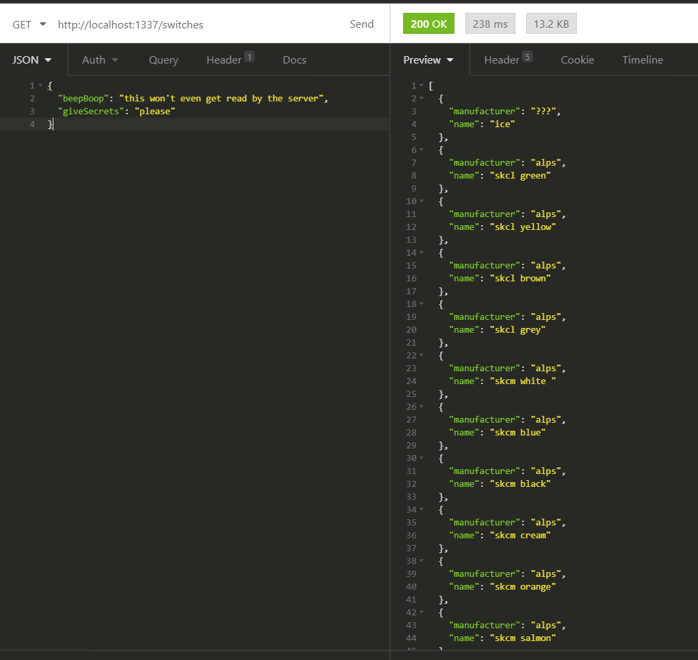
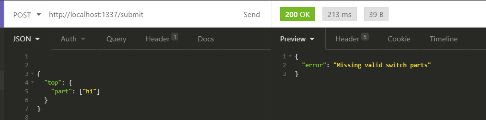
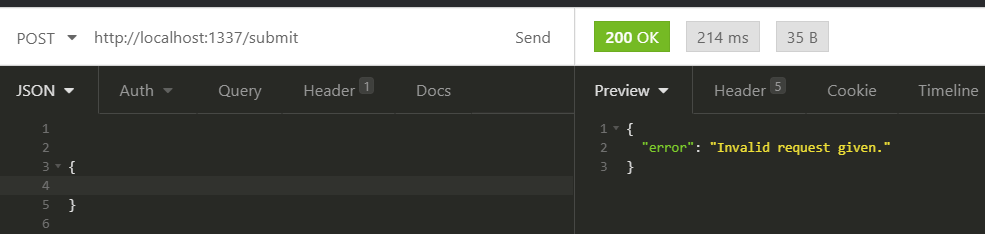
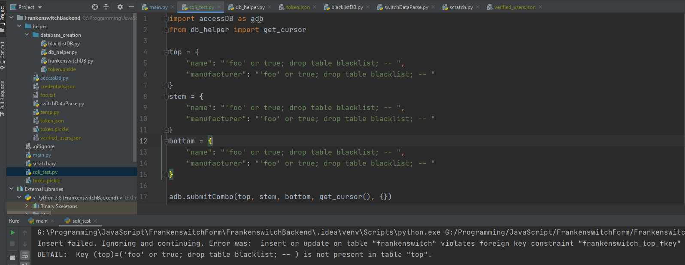

# XSS Attacks

- Went through entire frontend and collated all places where user may input data
  - Login Screen - 2 buttons
    - One directly logs in and no user data is passed
    - Other redirects to google's API so I don't have control over that
      - The information from google's API is only used as-is as text to insert into google sheets via their API
      - All the possible vulnerabilities with login and its data is offloaded to google's services rather than my own (i.e. google's login API and google sheets' API)
        - The possible problem here is that I am storing the name of the logged in user which is the one place where the user could input something malicious as their google account name that I have not predefined.
        - I think it is reasonably safe to assume that the names given from Google's API is safe to be passed back into google's own API again.
  - 4 identical user inputs for searching for a switch
    -  The actual input given by the user isn't used, it's only used to search for a pre-defined input
      - the user input never gets explicitly stored in the frontend and therefore never gets sent to the backend
      - The data is used to access the table of switches which is already publicly available in the frontend. 
      - The database tables are all inaccessible from the front end since no additional data is sent from the frontend to the backend outside of the GET request itself.
      - The user must choose one of the options in the given list
        - only the selections from the list is submitted to the backend
    - There are two endpoints in the backend that could be attacked, one of which (the table retrieval for switches) does not accept any user input
    -  The other endpoint accepts input from a POST request which could be vulnerable to SQL injections (discussed in the next section)

## SQL Injection

- Assuming a worst case scenario where an attacker can gain access to the backend's functions, I unit tested each function to see if I could inject code

- I started with the endpoints the backend server has
  - The `/switches` GET endpoint doesn't decode the request object that was sent to it and only returns the formatted version of the switches table.
    - Any data sent to it didn't change its behaviour
    - 
  - the `/submit` POST endpoint accepts user data and as long as the data isn't malformed, it will accept the data and continue
    - if the data is malformed, it will return an error message
  - This is possibly the entry point for an external attack since the function will accept anything that comes in the correct request format
  - 
  - 

- Getting wedged (thanks Richard Buckland for that term) so a lot of manual testing being done.

- Trying to drop the table but it is just being passed in a string
  - Used the inbuilt string formatting from psycopg2 which is meant to prevent sql injections
  - possible point of failure here is a vulnerability within the module itself
- I'm being forced to stop here for now because there was a surprise mandatory report for the something awesome project and I don't have the time budget to continue diving deeper. Leaving it in this format unless I get more time to work on it.
- I went to great lengths while I was working on the project to prevent sql injections by never using a string format inside of an execute and any string formatting I had done was passed in using psycopg2.

